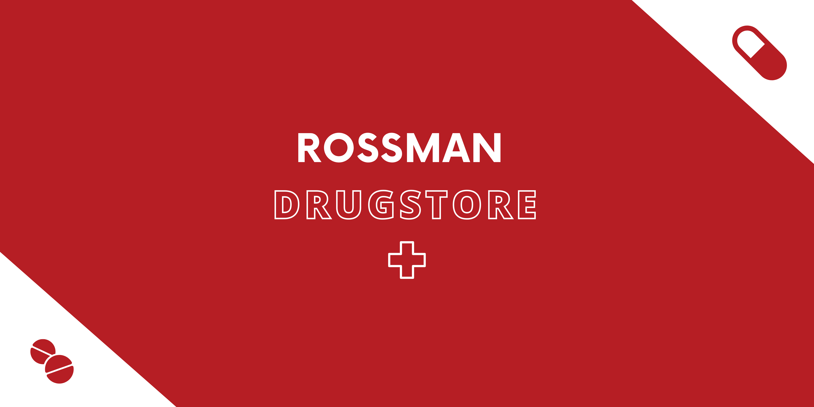

<p align="center">
  
  
  
  
  
</p>

💻 Conteúdos
=================
  * 🏠 [Sobre o projeto](#-sobre-o-projeto)
  * 🚀 [Como executar](#-como-executar)
  * ❓  [Questão de negócio](#-questão-de-negócio)
  * 📝 [Desenvolvimento da solução](#-desenvolvimento-da-solução)
  * 🔮  [Resultados](#-resultados)
  * ✅  [Próximos passos](#-próximos-passos)
  * 🦸 [Autora](#-autora)

---

## 🏠 Sobre o projeto
Rossman Drugstore Sales é um projeto que visa prever as vendas nas próximas semanas de uma rede de farmácias chamada Rossman. Para isso, diversos fatores são levados em conta como se os produtos estão em promoção, se há competição nas proximidades de uma loja, se é dia de feriado ou não, enter outros. Os dados para o problema foram obtidos do [Kaggle](https://www.kaggle.com/c/rossmann-store-sales/data).

---

## 🚀 Como executar

### Pré-requisitos

Antes de começar, você vai precisar ter instalado em sua máquina as seguintes ferramentas:
[Git](https://git-scm.com) e [Python](https://www.python.org/).

#### 🎲 Rodando localmente

```bash
# Clone este repositório
$ git clone https://github.com/nathaliaop/rossman-drugstore-sales.git

# Acesse a pasta do projeto no terminal/cmd
$ cd rossman-drugstore-sales

# Instale as dependências do ambiente virtual
$ pip install -r requirements.txt

# Preprocessamento da base de dados
$ python data_preprocessing.py

# Treinando o modelo
$ python random_forest_regression.py

# As predições podem ser acessadas no arquivo csv 'result_data/random_forest_regression.csv'
```

---

## ❓ Questão de negócio

A franquia Rossman tem dificuldades em fazer um planejamento financeiro, pois cada loja prevê seu faturamento indivualmente. Assim, o objetivo deste projeto é unir os dados de todas as lojas da franquia para tentar obter predições mais precisas, permitindo assim que a franquia Rossman saiba com antecedência os dias em que o faturamento será maior ou menor.

---

## 📝 Desenvolvimento da solução
Primeiramente, foi preciso precessar os dados. Os valores ausentes foram substituídos pela média dos valores em todas as lojas nais quais aquele parâmetro é conhecido. Depois, os seguintes modelos foram treinados: Regressão Linear Múltipla, Regressão Polinomial, Árvore de Decisão e Random Forest. Os dois primeiros tiverame um desempenho bem abaixo do ideal, prevendo valores negativos e com acurácia de aproximadamente 50% e 60% respectivamente. Os dois últimos se saíram bem, com acurácia de aproximadamente 85% e 90% respectivamente.

---

## 🔮 Resultados
Exemplo das predições de venda para os primeiros dias do mês de agosto de 2015:


## ✅ Próximos Passos
O modelo do random forest já foi colocado em produção, então seria interessante desenvolver uma maneira do usuário fazer requisições à API por meio de alguma interface como um website ou por meio de alguma serviço intermediário como o Telegram ou o Discord.

---

## 🦸 Autora


Nathália Oliveira Pereira

<div> 
  <a href = "mailto:np.nathaliapereira@gmail.com"></a>
  <a href="https://www.linkedin.com/in/nathalia-oliveira-pereira" target="_blank"></a> 
</div>
